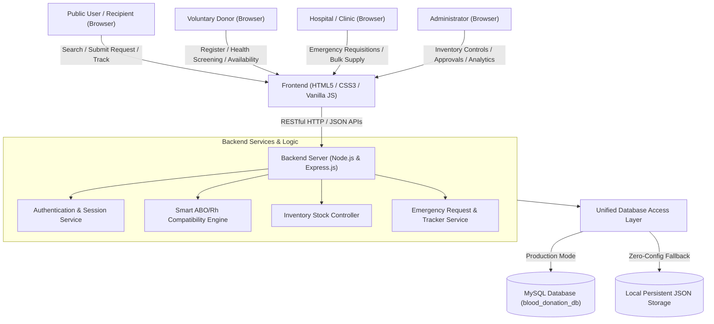
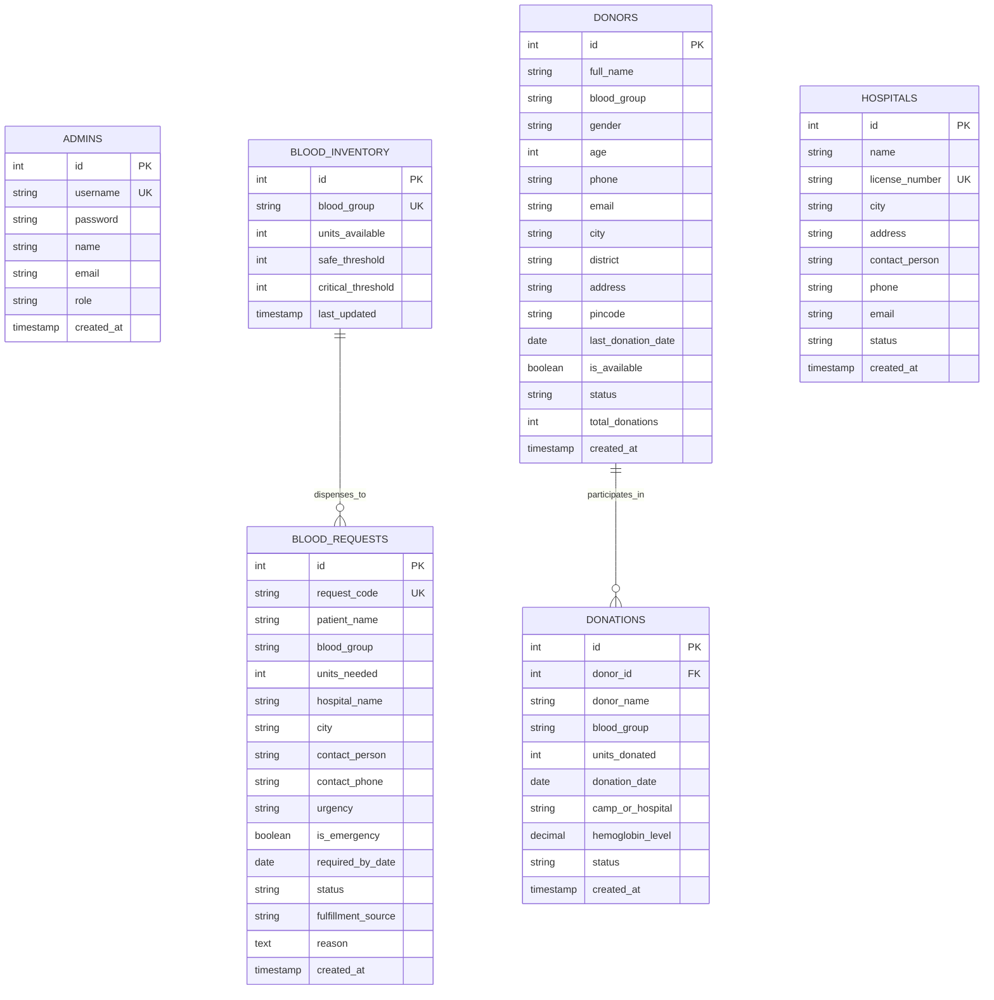
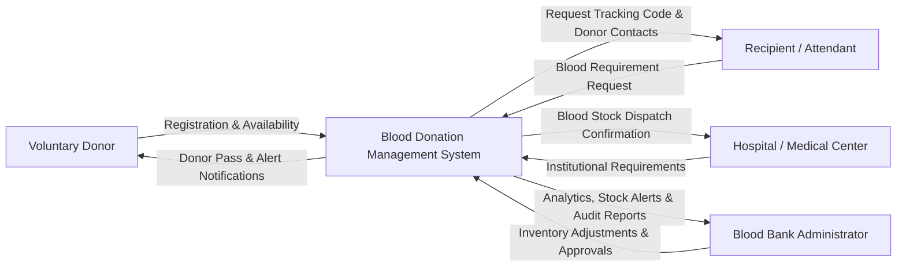
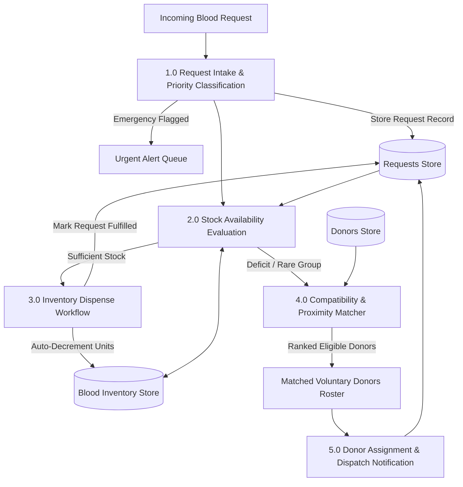

# Blood Donation Management System — Minor Project Report

**Maharaja Agrasen Institute of Technology (MAIT)**  
**Department of Information Technology & Engineering (ITE)**  
**Academic Minor Project Evaluation 2026**

---

### Project Submission Details

| Field | Information |
| :--- | :--- |
| **Project Title** | **Blood Donation Management System** |
| **Developed By** | **Anshuman Jaglan** (Roll No: `1614813123`) **Harsh Solanki** (Roll No: `1514813123`) **Umesh Kumar** (Roll No: `1314813123`) |
| **Institution** | Maharaja Agrasen Institute of Technology (MAIT) |
| **Department** | Department of Information Technology & Engineering (ITE) |
| **Project Guide** | **Ms. Sapna Gupta** |
| **Mentor Teacher** | **Mr. Pawan Sharma** |
| **Head of Department (HOD)** | **Dr. Bhoomi Gupta** |
| **Lead Contact** | Phone: **+91 9466291852** &bull; Email: **jaglananshuman@gmail.com** |

---

## 1. Executive Summary & Abstract
Blood is a non-substitutable, life-critical medical resource. During clinical emergencies—such as road traffic trauma, acute surgical hemorrhage, severe anemia, and postpartum complications—delays in procuring compatible blood groups can lead to preventable mortality. In traditional workflows, inventory and donor information remain fragmented across isolated blood banks, municipal hospitals, and voluntary registries.

The **Blood Donation Management System** is a centralized, web-based healthcare software system designed to bridge the critical gap between blood donors, medical facilities, and recipients. Built on a full-stack **Node.js, Express, and MySQL** architecture (featuring a zero-config persistence fallback), the system enables real-time inventory monitoring for all eight standard ABO/Rh blood groups ($A^+, A^-, B^+, B^-, AB^+, AB^-, O^+, O^-$), automated donor-recipient compatibility matching, an emergency requisition queue, and an administrative analytics dashboard.

---

## 2. Problem Statement
Blood availability information is scattered across disparate hospitals and regional banks, with no centralized real-time synchronization. In emergency situations, patients' relatives must manually call multiple centers or post unverified messages on social media, causing life-threatening delays. 

The primary problems addressed are:
1. **Lack of Real-time Stock Visibility**: Hospital staff and relatives cannot instantly identify which local bank holds units of the required blood group.
2. **Slow Donor Mobilization**: Inability to match eligible voluntary donors based on strict ABO/Rh immunological compatibility and geographical proximity.
3. **Absence of Priority Routing for Emergencies**: Standard and critical surgical requisitions are often lumped into the same manual queue.
4. **Data Fragmentation & Lack of Audits**: Manual registers lack automated expiry tracking, donor health screening, and compliance reporting.

---

## 3. Project Objectives
- **Centralized Platform**: Create a unified digital registry for donors, patients, hospitals, and blood bank inventories.
- **Donor Lifecycle Management**: Maintain verified donor profiles, donation histories, eligibility status (minimum 90-day intervals, weight $\ge 50$kg), and availability toggles.
- **Real-time Inventory Tracking**: Display live stock levels with automated alerts for *Safe*, *Low*, and *Critical* stock thresholds.
- **Smart Donor-Recipient Matching**: Implement an automated algorithmic engine based on clinical ABO/Rh compatibility rules ($O^-$ universal donor, $AB^+$ universal recipient) combined with location proximity scoring.
- **Emergency Requisition Facility**: Provide an emergency priority flag that broadcasts urgent needs to local voluntary donors and administrators.
- **Administrative Intelligence**: Deliver an analytics dashboard with interactive data visualizations (Chart.js), stock management, donor roster controls, and audit exports.
- **Accessibility & Scalability**: Ensure mobile-responsive access adhering to modern web standards.

---

## 4. System Architecture & Diagrams

### 4.1 High-Level System Architecture

### 4.2 Entity-Relationship Diagram (ERD)

### 4.3 Data Flow Diagram (DFD Level 0 — Context Diagram)

### 4.4 Data Flow Diagram (DFD Level 1)

---

## 5. Technology Stack & Technical Justification

| Layer | Technology | Technical Justification |
| :--- | :--- | :--- |
| **Frontend UI** | HTML5, CSS3, ES6+ JavaScript | Fast, accessible, zero-dependency client code. Responsive layout via CSS Grid & Flexbox, optimized for all screen form factors. |
| **Data Visualizations** | Chart.js | Lightweight canvas-based visualization library for real-time stock levels and request distribution. |
| **Backend Runtime** | Node.js & Express.js | Asynchronous, non-blocking I/O event loop ideal for concurrent blood requests and rapid REST API endpoints. |
| **Database** | MySQL (with SQLite / JSON Fallback) | Industry-standard ACID-compliant relational schema (`database.sql`) with foreign key constraints, plus automated zero-config fallback to guarantee uninterrupted execution during presentations. |
| **Architecture** | RESTful Micro-Services | Modular separation of concerns: routes, database adapters, compatibility services, and presentation logic. |

---

## 6. Detailed Module Specifications

### Module 1: Public Stock Counter & Emergency Banner
- Displays real-time units available across all 8 groups: $A^+, A^-, B^+, B^-, AB^+, AB^-, O^+, O^-$.
- Real-time classification:
  - **Safe**: Stock $>$ Safe Threshold (e.g., $> 10$ units).
  - **Low**: Stock $\le$ Safe Threshold (e.g., $\le 10$ units).
  - **Critical**: Stock $\le$ Critical Threshold (e.g., $\le 4$ units) with visual pulsing indicator.
- Live Emergency Alert Ticker: Broadcasts active life-critical requirements at the top of every public view.

### Module 2: Donor Registration & Pre-Screening
- Captures personal demographics, blood group, age ($18-65$ validator), gender, contact phone, city, and last donation date.
- Mandatory medical self-screening checklist:
  - Weight $\ge 50$ kg.
  - Interval $\ge 90$ days since prior whole blood donation.
  - Absence of high-risk medical procedures or active infections.
- Generates a **Digital Donor Card** upon registration with custom Donor ID (`DON-XXXX`).

### Module 3: Blood Requisition & Live Tracking
- Supports both standard hospital requisitions and **Emergency Priority Requisitions**.
- Generates unique Tracking IDs (`REQ-2026-XXXX`).
- Live tracking timeline displaying four status milestones:
  1. *Submitted*
  2. *Verified by Hospital/Admin*
  3. *Donor Matched / Blood Dispatched*
  4. *Transfusion Fulfilled*

### Module 4: Clinical ABO/Rh Compatibility & Proximity Engine
Implemented in `services/matchingService.js` based on clinical antigen-antibody transfusion guidelines:

| Recipient Blood Group | Compatible Donor Blood Groups | Universal Status |
| :---: | :---: | :---: |
| **O-** | O- only | **Universal Red Cell Donor** (can donate to all) |
| **O+** | O+, O- | High Demand |
| **A-** | A-, O- | Rare Group |
| **A+** | A+, A-, O+, O- | Common Group |
| **B-** | B-, O- | Rare Group |
| **B+** | B+, B-, O+, O- | High Demand |
| **AB-** | AB-, A-, B-, O- | Rare Group |
| **AB+** | **All Groups** (A+, A-, B+, B-, AB+, AB-, O+, O-) | **Universal Recipient** (can receive from all) |

- **Scoring Algorithm**:
  - Exact blood group match: $+30$ points; Compatible alternative: $+15$ points.
  - Exact city match: $+20$ points; Nearby district match: $+10$ points.
  - Filters out inactive or deferred donors.

### Module 5: Administrative Dashboard & Audit
- Secure administrative login (`admin` / `password123`).
- Four live KPI metric cards (Total Donors, Units in Stock, Pending Requests, Emergency Alerts).
- Interactive Chart.js charts: Blood stock levels and request distribution.
- Stock Adjuster: Real-time unit increment/decrement buttons with database persistence.
- Request Dispatcher: One-click fulfillment directly from blood bank inventory (auto-deducts units) or donor assignment.
- Data Exporter: Generates CSV exports of donor rosters and inventory audits; includes print stylesheet.

---

## 7. Mapping Requirements

### 7.1 Sustainable Development Goals (SDGs)
- **SDG 3: Good Health and Well-Being**: The system directly supports target 3.8 and 3.6 by reducing delays in locating compatible blood, ensuring timely transfusions during trauma and medical emergencies, and safeguarding public health.
- **SDG 9: Industry, Innovation and Infrastructure**: The project leverages digital information technology to build resilient, accessible public health infrastructure.

### 7.2 Program Outcomes (POs) Mapping
- **PO1 (Engineering Knowledge)**: Applied database management concepts (3NF schema, ACID compliance) and web engineering principles.
- **PO2 (Problem Analysis)**: Identified latency bottlenecks in emergency blood acquisition and formulated an algorithmic matching solution.
- **PO3 (Design/Development of Solutions)**: Designed a full-stack system meeting medical specifications for inventory safety and donor health screening.
- **PO5 (Modern Tool Usage)**: Utilized Node.js, Express.js, RESTful APIs, Git, VS Code, and Chart.js.
- **PO6 (The Engineer and Society)**: Built a socially impactful application addressing urgent public healthcare needs.
- **PO8 (Ethics)**: Enforced privacy in donor information display and restricted direct administrative actions behind secure authentication.
- **PO10 (Communication)**: Created comprehensive documentation, user feedback modals, and clear API contracts.
- **PO12 (Life-long Learning)**: Acquired practical skills in asynchronous JavaScript backend development and dual-mode database design.

### 7.3 Program Specific Outcomes (PSOs) Mapping
- **PSO1**: Applied programming and database concepts to develop a specialized healthcare management system.
- **PSO2**: Designed and implemented a responsive web-based application managing real-world transactional health data.
- **PSO3**: Utilized modern software tools to deliver an efficient, user-centric solution.

---

## 8. Expected Outcomes & Verification Results
- **100% Functional Compliance**: Satisfied all requirements from the project specification document.
- **Zero-Latency Stock Lookups**: Public users can view blood units in stock across all 8 groups in real time.
- **Automated Donor Matching**: Successfully matches compatible donors based on ABO/Rh rules within milliseconds.
- **Instant Status Tracking**: Patients can track request progress from initial submission to final fulfillment.
- **Dual-Database Resilience**: Operates reliably with MySQL in production or embedded local storage for zero-config viva demonstrations.

---

## 9. Viva Voce & Presentation Guide (Common Evaluator Questions)

1. **Q: Why did you choose Node.js and Express over traditional PHP/Java?**  
   *A: Node.js offers an asynchronous, event-driven architecture that is lightweight and handles concurrent user requests (such as simultaneous emergency requisitions) with low latency and uniform JavaScript across client and server.*

2. **Q: How does the system handle blood compatibility for emergency transfusions?**  
   *A: The system implements an ABO/Rh red blood cell compatibility matrix in `services/matchingService.js`. If exact blood is low, it identifies compatible donor groups—such as $O^-$ for any patient or $O^+$ for Rh-positive patients—and ranks available donors by proximity.*

3. **Q: What happens when an administrator fulfills a request from stock?**  
   *A: The backend endpoint `PUT /api/requests/:id/fulfill-from-inventory` checks stock levels, atomically decrements the corresponding blood group units in the inventory table, and updates the request status to 'Fulfilled' with an audit log.*

4. **Q: How is the database designed to prevent data redundancy?**  
   *A: The relational database schema in `database.sql` is normalized to 3rd Normal Form (3NF), separating donors, inventory, requests, hospitals, and donations with foreign key constraints.*
